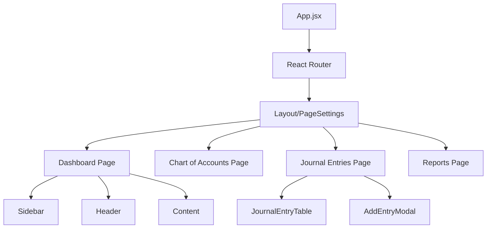
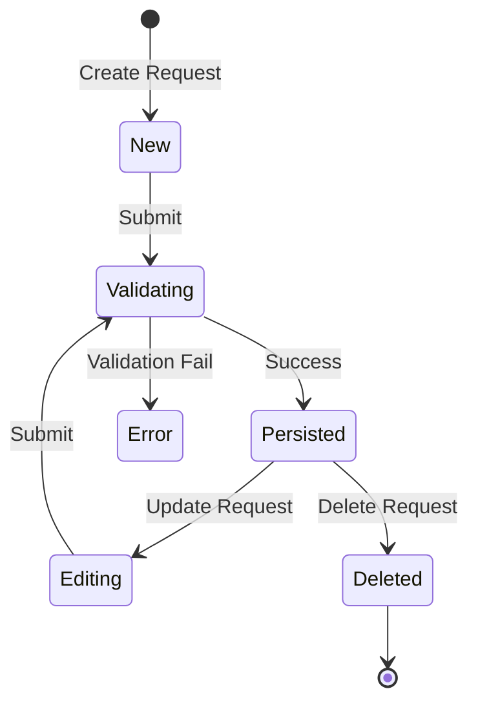

# Technical Documentation: myEasyLedger

This document provides a comprehensive technical overview of the myEasyLedger system, designed for senior engineers and new team members.

## 1. Architecture & Visualization

### High-Level System Overview
The system follows a classic three-tier architecture: a React-based frontend, a Spring Boot backend, and a PostgreSQL database.

### Authentication Flow
Authentication is handled via JWT (JSON Web Tokens). The backend uses Spring Security to protect endpoints, and the frontend manages tokens in memory and local storage.

### Core Domain Model
The following diagram illustrates the primary entities and their relationships within the system.

### Component Hierarchy (Frontend)
The React application is structured around pages and reusable components.

### Journal Entry State Transition
Simplified logic for creating and editing journal entries.

---

## 2. Dependency Analysis

### Backend (Spring Boot)
- **Spring Boot Starter Web**: Core for building RESTful APIs.
- **Spring Boot Starter Data JPA**: For ORM and database interaction using Hibernate.
- **PostgreSQL Driver**: Connectivity to the PostgreSQL database.
- **Spring Security**: Robust authentication and authorization framework.
- **JJWT (io.jsonwebtoken)**: Implementation for generating and parsing JWTs.
- **Spring Mail**: Service for sending emails (registration, password reset).
- **Hibernate Types**: Extra types for Hibernate (e.g., JSONB support if needed).

### Frontend (React)
- **React 17**: Core UI library.
- **React Router Dom**: Client-side routing.
- **Axios**: HTTP client for API requests.
- **Bootstrap / Reactstrap**: UI styling and components.
- **ApexCharts / Chart.js**: Data visualization for reports and dashboard.
- **JWT Decode**: Utility to decode JWT payloads on the client side.

---

## 3. Key Modules

### Backend (`rest_api/src/main/java/com/easyledger/api/`)
- **`controller`**: Defines REST endpoints and handles incoming HTTP requests.
- **`service`**: Contains business logic, ensuring separation from the web layer.
- **`repository`**: JPA repositories for data access.
- **`model`**: Entity classes representing the database schema.
- **`security`**: Configuration for JWT, CORS, and endpoint protection.
- **`dto` / `payload` / `viewmodel`**: Objects for data transfer between layers and to the frontend.
- **`exception`**: Custom exception classes and global error handling.

### Frontend (`front_end/src/`)
- **`pages/`**: Main view components corresponding to routes (Dashboard, Accounts, etc.).
- **`components/`**: Reusable UI elements (Headers, Sidebars, Modals).
- **`config/`**: Routing definitions and global application settings.
- **`utils/`**: Helper functions, i18n, and Axios interceptors for auth headers.

---

## 4. API / Interface Map

| Controller | Responsibility | Key Endpoints |
| :--- | :--- | :--- |
| `AuthController` | User auth & account management | `/signin`, `/signup`, `/forgotPassword` |
| `AccountController` | Chart of accounts management | `/account`, `/organization/{id}/account` |
| `JournalEntryController` | Journal entry operations | `/journalEntry`, `/organization/{id}/journalEntry` |
| `ReportsController` | Financial report generation | `/balanceSheet`, `/incomeStatement`, `/cashFlow` |
| `OrganizationController` | Organization/Ledger settings | `/organization`, `/organization/{id}` |
| `PersonController` | User profile & permissions | `/person`, `/person/{id}` |

---

## 5. Developer Onboarding

### Environment Setup

#### Database
1. Install **PostgreSQL 13**.
2. Create a database named `easyledger`.
3. Create a schema named `public`.
4. Restore from `db/db_schema_and_metadata` (empty) or `db/db_full` (sample data).

#### Backend
1. Ensure **Java 8** and **Maven** are installed.
2. Configure `rest_api/src/main/resources/application.properties` with your DB credentials and JWT secret.
3. Run: `mvn spring-boot:run`

#### Frontend
1. Ensure **Node.js 14** and **npm** are installed.
2. Navigate to `front_end/` and run `npm install`.
3. Start the dev server: `npm start`

### Running Tests
- **Backend**: `mvn test`
- **Frontend**: `npm test`
