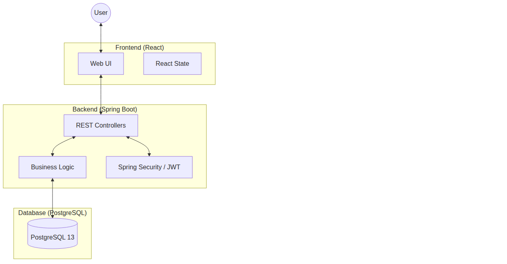
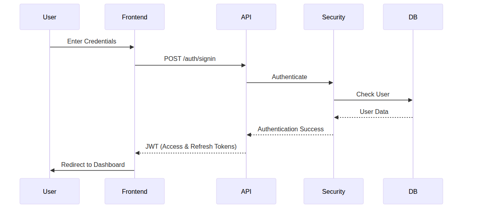
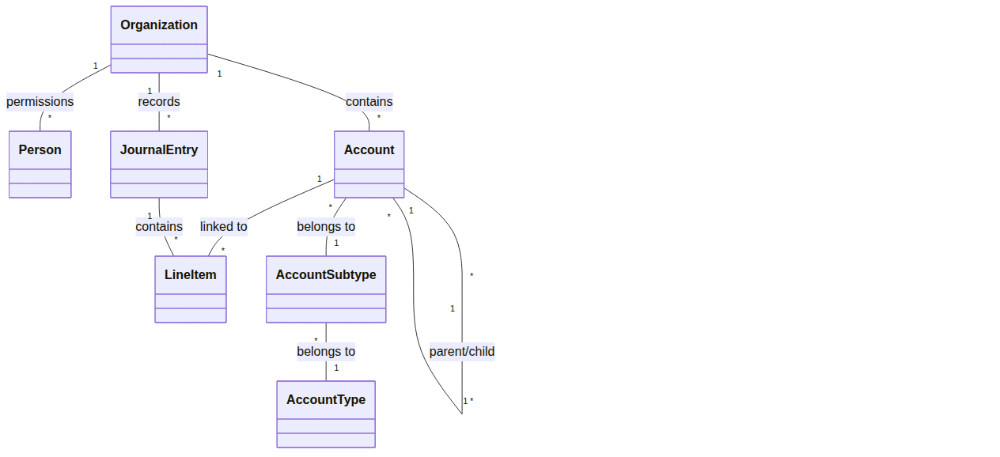
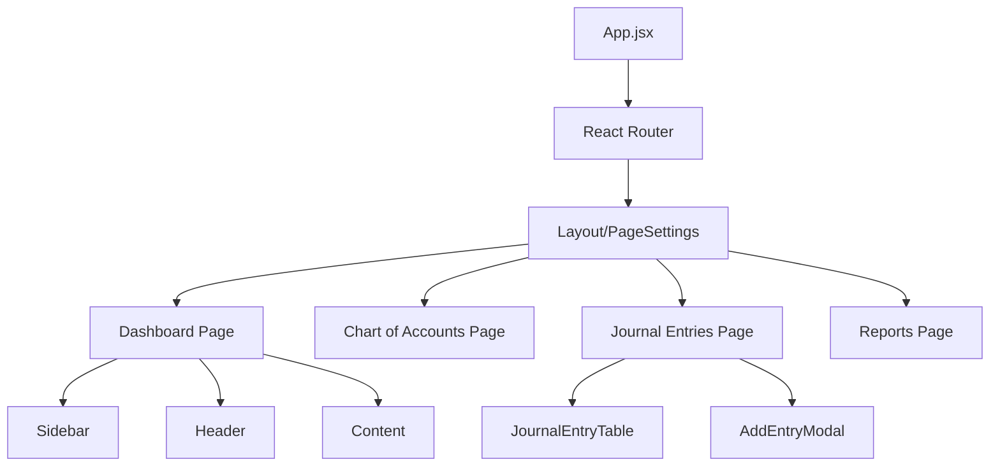
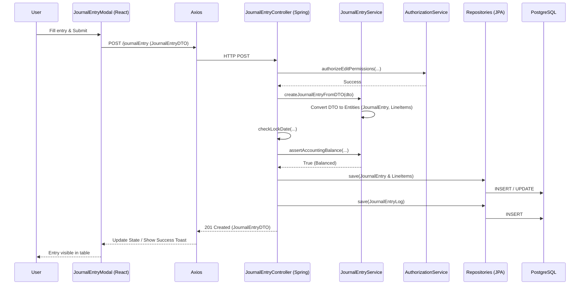
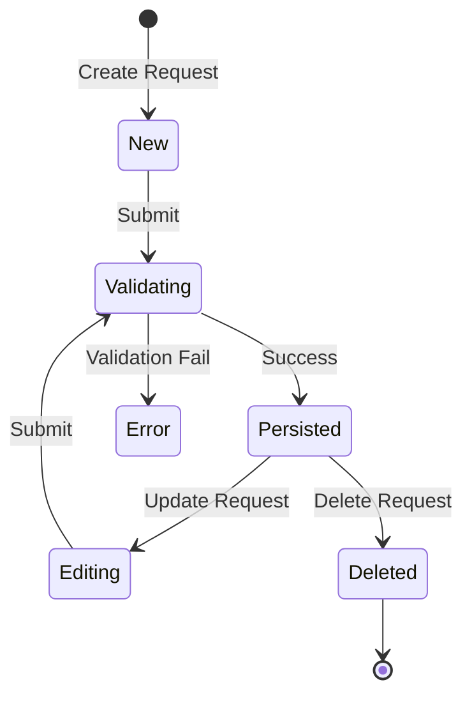

# Technical Documentation: myEasyLedger

This document provides a comprehensive technical overview of the myEasyLedger system, designed for senior engineers and new team members. It serves as a high-utility maintenance guide and architectural reference.

## Table of Contents
1.  [Architecture Overview](#1-architecture-overview)
2.  [Path of a Request](#2-path-of-a-request)
3.  [State Management & Data Flow](#3-state-management--data-flow)
4.  [Critical Modules & Hot Paths](#4-critical-modules--hot-paths)
5.  [Backend Services](#5-backend-services)
6.  [Side Effects & Integrations](#6-side-effects--integrations)
7.  [Extension Guide](#7-extension-guide)
8.  [Dependency Analysis](#8-dependency-analysis)
9.  [Key Modules](#9-key-modules)
10. [API / Interface Map](#10-api--interface-map)
11. [Developer Onboarding](#11-developer-onboarding)

---

## 1. Architecture Overview

### High-Level System Overview
The system follows a classic **three-tier architecture**:
*   **Frontend**: A single-page application (SPA) built with React 17.
*   **Backend**: A RESTful API built with Spring Boot (Java 8).
*   **Data Store**: A PostgreSQL database for persistent storage.

### Design Patterns
*   **Controller-Service-Repository**: The backend follows this pattern to separate concerns:
    *   **Controllers** handle HTTP requests, input validation, and DTO mapping.
    *   **Services** contain core business logic and transactional boundaries.
    *   **Repositories** manage data access using Spring Data JPA.
*   **DTO & ViewModel**:
    *   **DTOs (Data Transfer Objects)** are used for incoming request bodies to decouple the API from the database schema.
    *   **ViewModels** are specialized objects used for outgoing responses, often aggregating data from multiple entities (especially in reports).

### Authentication Flow
Authentication is handled via **JWT (JSON Web Tokens)**. The backend uses Spring Security to protect endpoints, and the frontend manages tokens in local storage.

### Core Domain Model
The following diagram illustrates the primary entities and their relationships within the system.

### Component Hierarchy (Frontend)
The React application is structured around pages and reusable components.

---

## 2. Path of a Request

Tracing a standard data flow: **Creating a Journal Entry (Enterprise Mode)**.

### Journal Entry State Transition
Simplified logic for creating and editing journal entries.

---

## 3. State Management & Data Flow

### Frontend State
*   **Global Context**: The `PageSettings` context (located in `app.jsx`) acts as the global state store. It holds:
    *   User identification (`personId`, `firstName`, `lastName`).
    *   Current session context (`currentOrganizationId`, `currentPermissionTypeId`).
    *   Application preferences (`locale`, `appearance`, `colorScheme`).
*   **Persistence**: The JWT is stored in `localStorage` under the key `ACCESS_TOKEN`. On app load, `checkForAuthentication()` validates this token and re-populates the context.

### Backend State
*   **Stateless Security**: The backend is primarily stateless. Each request must carry a valid JWT in the `Authorization` header.
*   **Security Context**: The `JwtAuthenticationFilter` intercepts requests, extracts the user details, and populates the `SecurityContextHolder` with a `UserPrincipal`.

---

## 4. Critical Modules & Hot Paths

These modules are core to the application's integrity and are frequently modified:

*   **`JournalEntryService`**: Manages the creation and update of double-entry ledger records. Any changes here must ensure that the "Debits = Credits" invariant is never violated.
*   **`ReportsService`**: The engine for generating financial statements. It handles complex aggregations for:
    *   **Balance Sheet**: Uses `negateAmountsOfAccounts` to adjust for standard accounting representation.
    *   **Income Statement**: Manages fiscal year boundaries and retained earnings calculations.
    *   **Cash Flow Statement**: Categorizes accounts into Operating, Investing, and Financing activities.
*   **`AuthorizationService`**: The gatekeeper for organization-level security. It verifies that users have `VIEW`, `EDIT`, or `ADMIN` permissions before any data operation.

---

## 5. Backend Services

The backend logic is encapsulated in several service classes, ensuring a clean separation from the controller layer.

| Service | Responsibility |
| :--- | :--- |
| `AccountService` | Manages account creation, balance calculations, and auto-populates default accounts for new organizations (Personal/Enterprise). |
| `AuthorizationService` | A security-focused service that validates user permissions (`VIEW`, `EDIT`, `ADMIN`, `OWN`) against organizations. |
| `CustomerService` | Handles business logic for Customer entities, including duplicate name detection within an organization. |
| `EmailDispatchService` | Generates and dispatches specific transactional emails (Verification, Password Reset, Invitation) using localized templates. |
| `JournalEntryService` | Core service for ledger operations. Handles DTO-to-Entity conversion, accounting balance assertions, and complex search queries. |
| `LineItemService` | Manages the creation of individual line items and provides filtered data retrieval for specific accounts or organizations. |
| `OrganizationService` | Handles organization-level operations, such as generating monthly net asset statistics and date range presets for reports. |
| `PersonService` | Manages user lifecycle logic, including registration (SignUp), profile updates, and password management. |
| `ReportsService` | The most complex service in the system; it aggregates data from across the DB to generate GAAP-compliant financial statements. |
| `VendorService` | Manages business logic for Vendor entities, ensuring data integrity and uniqueness within an organization's context. |
| `VerificationService` | Manages the lifecycle of UUID tokens and 6-digit codes used for email verification and two-factor authentication. |

---

## 6. Side Effects & Integrations

### External Integrations
*   **Email Service**: `EmailDispatchService` handles all transactional emails (Account Verification, Invitations, Password Resets). It uses Thymeleaf templates for localized HTML emails.
    *   *Note: Emails are currently sent synchronously. Large batches may impact response times.*

### Internal Side Effects
*   **Journal Entry Logging**: Every create, update, or delete operation on a journal entry triggers an automatic entry in the `JournalEntryLog` table for audit purposes.
*   **JWT Lifecycle**: The `JwtTokenProvider` manages the generation and parsing of tokens, including expiration logic.

---

## 7. Extension Guide

### Adding a New Feature
To implement a new feature (e.g., "Budgeting"), follow this standard path:

1.  **Backend Implementation**:
    *   **Model**: Create a `@Entity` in `com.easyledger.api.model`.
    *   **DTO**: Define a request DTO in `dto/`.
    *   **Repository**: Create an interface extending `JpaRepository` in `repository/`.
    *   **Service**: Implement business logic and validation in `service/`.
    *   **ViewModel**: Create a response DTO in `viewmodel/` if the output differs from the input.
    *   **Controller**: Define REST endpoints in `controller/`. Use `@Secured` for role protection.

2.  **Frontend Implementation**:
    *   **Page**: Create a new component directory in `front_end/src/pages/`.
    *   **Route**: Register the new path in `front_end/src/config/page-route.jsx`.
    *   **Menu**: Add the link to `enterpriseMenu` or `personalMenu` in `front_end/src/components/sidebar/menu.jsx`.

---

## 8. Dependency Analysis

### Backend (Spring Boot)
- **Spring Boot Starter Web**: Core for building RESTful APIs.
- **Spring Boot Starter Data JPA**: For ORM and database interaction using Hibernate.
- **PostgreSQL Driver**: Connectivity to the PostgreSQL database.
- **Spring Security**: Robust authentication and authorization framework.
- **JJWT (io.jsonwebtoken)**: Implementation for generating and parsing JWTs.
- **Spring Mail**: Service for sending emails (registration, password reset).

### Frontend (React)
- **React 17**: Core UI library.
- **React Router Dom**: Client-side routing.
- **Axios**: HTTP client for API requests.
- **Bootstrap / Reactstrap**: UI styling and components.
- **ApexCharts / Chart.js**: Data visualization for reports and dashboard.

---

## 9. Key Modules

### Backend (`rest_api/src/main/java/com/easyledger/api/`)
- **`controller`**: Defines REST endpoints and handles incoming HTTP requests.
- **`service`**: Contains business logic, ensuring separation from the web layer.
- **`repository`**: JPA repositories for data access.
- **`model`**: Entity classes representing the database schema.
- **`security`**: Configuration for JWT, CORS, and endpoint protection.
- **`dto` / `payload` / `viewmodel`**: Objects for data transfer between layers.

### Frontend (`front_end/src/`)
- **`pages/`**: Main view components corresponding to routes (Dashboard, Accounts, etc.).
- **`components/`**: Reusable UI elements (Headers, Sidebars, Modals).
- **`config/`**: Routing definitions and global application settings.
- **`utils/`**: Helper functions, i18n, and Axios interceptors for auth headers.

---

## 10. API / Interface Map

The system exposes a RESTful API. All endpoints are prefixed with the version (e.g., `/v0.6.1`).

| Controller | Responsibility | Key Endpoints |
| :--- | :--- | :--- |
| `AccountController` | CRUD operations for the Chart of Accounts. | `/account`, `/organization/{id}/account` |
| `AccountSubtypeController` | Retrieves account subtypes and their balances. | `/accountSubtype`, `/organization/{id}/accountSubtypeBalance` |
| `AccountTypeController` | Retrieves base account types and monthly summaries. | `/accountType`, `/organization/{id}/accountTypeSummary` |
| `AuthController` | Handles JWT-based authentication and user registration. | `/signin`, `/signup`, `/forgotPassword` |
| `CustomerController` | CRUD operations for Customers. | `/customer`, `/organization/{id}/customer` |
| `InvitationController` | Manages the workflow for inviting users to organizations. | `/invitation`, `/accept-invitation` |
| `JournalEntryController` | Core ledger operations and transaction logging. | `/journalEntry`, `/organization/{id}/journalEntry` |
| `LineItemController` | Provides access to individual transaction line items. | `/lineItem`, `/account/{id}/lineItem` |
| `OrganizationController` | Manages organization settings and high-level stats. | `/organization`, `/organization/{id}` |
| `PermissionController` | Manages fine-grained user access within organizations. | `/permission`, `/organization/{id}/permission` |
| `PersonController` | User profile management and global settings. | `/person`, `/person/{id}` |
| `ReportsController` | Generates comprehensive financial reports. | `/balanceSheet`, `/incomeStatement`, `/cashFlow` |
| `VendorController` | CRUD operations for Vendors. | `/vendor`, `/organization/{id}/vendor` |
| `VerificationController` | Validates email verification and reset tokens. | `/verification/{token}` |

---

## 11. Developer Onboarding

### Environment Setup

#### Database
1. Install **PostgreSQL 13**.
2. Create a database named `easyledger`.
3. Create a schema named `public`.
4. Restore from `db/db_schema_and_metadata` (empty) or `db/db_full` (sample data).

#### Backend
1. Ensure **Java 8** and **Maven** are installed.
2. Configure `rest_api/src/main/resources/application.properties` with your DB credentials and JWT secret.
3. Run: `mvn spring-boot:run`

#### Frontend
1. Ensure **Node.js 14** and **npm** are installed.
2. Navigate to `front_end/` and run `npm install`.
3. Start the dev server: `npm start`

### Running Tests
- **Backend**: `mvn test`
- **Frontend**: `npm test`
